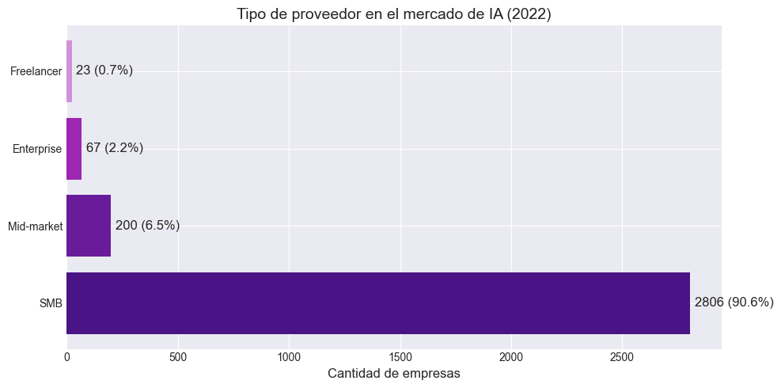
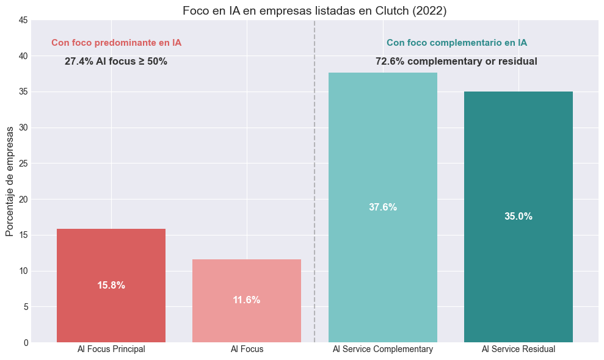
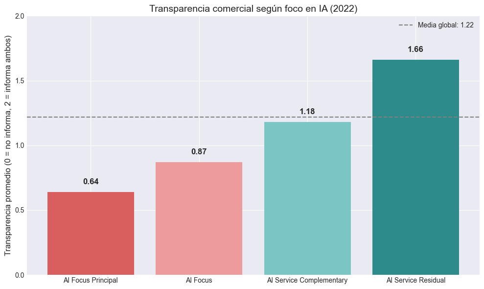
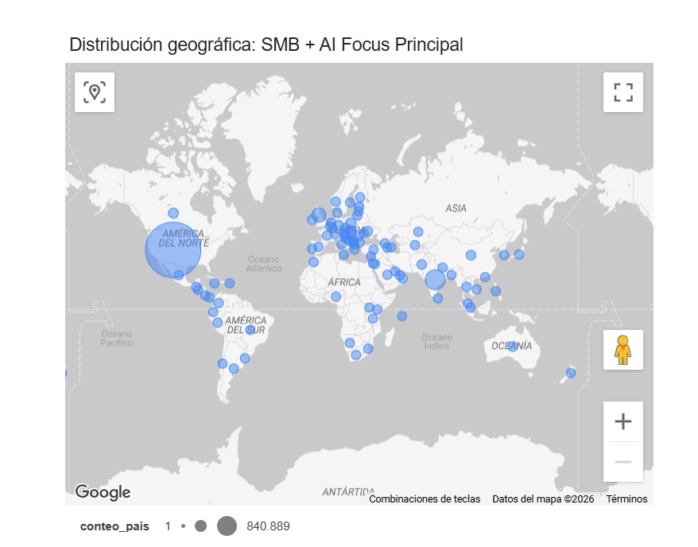

# Understanding the 2022 AI Companies Landscape

**Marcela Zena · Agosto 2026**

## Sobre este proyecto

En 2022, antes de la adopción masiva de la IA generativa, miles de empresas ya ofrecían servicios relacionados con Inteligencia Artificial.

**¿Cómo era el ecosistema de empresas que ofrecían servicios de IA en 2022?**

Este proyecto explora un dataset público de aproximadamente 3.100 empresas listadas en Clutch.co en 2022 para comprender el ecosistema representado en los datos: dónde estaban ubicadas las empresas, qué tipos de proveedores existían, qué peso tenía la IA dentro de su oferta y qué diferencias aparecían entre distintos segmentos.

El dataset es imperfecto y representa una única fuente.

En lugar de tratar esas limitaciones como algo a eliminar, forman parte de la investigación: entender qué pueden decirnos los datos, qué no pueden decirnos y qué nuevas preguntas aparecen a partir de ellos.

---

## Preguntas iniciales

El análisis comenzó con una pregunta amplia:

**¿Qué puedo comprender de este dataset y del ecosistema de empresas de IA que representa?**

A partir de ahí aparecieron nuevas preguntas:

- ¿Dónde estaban ubicadas estas empresas?
- ¿Qué tipos de proveedores estaban representados?
- ¿Qué tan central era la IA dentro de su oferta de servicios?
- ¿Existían diferencias entre empresas según tamaño, especialización o geografía?
- ¿Qué nuevas preguntas aparecían al segmentar el mercado?

---

## Del dataset a una nueva mirada

El dataset original contiene información sobre empresas, ubicación, servicios relacionados con IA y algunos datos comerciales, como tamaño mínimo de proyecto y tarifa promedio por hora.

Antes de analizarlo fue necesario explorar su calidad, limpiar información inconsistente, normalizar datos geográficos y construir nuevas variables.

El proceso completo y las decisiones metodológicas están documentados en el **notebook**.

[**Ver notebook →**](notebooks/Understanding_2022_AI_Companies_Landscape.ipynb).

---

## Tres dimensiones que permiten mirar los datos de otra manera

Pero el objetivo no era solamente limpiar el dataset.

Era encontrar una forma distinta de mirar esas aproximadamente 3.100 empresas, no solo como un listado.

Para eso construí tres dimensiones:

**Tipo de proveedor × Foco en IA × Transparencia comercial**

### 1. Tipo de proveedor: el 90,6% son SMB

A partir del rango de empleados informado por Clutch, clasifiqué las empresas en cuatro grandes grupos:



Las **SMB dominan ampliamente la muestra**, pero no constituyen un grupo homogéneo.

Algunas muestran una fuerte especialización en IA, mientras que para otras la IA representa solamente una parte de una oferta más amplia.

Al no disponer de información sobre facturación, activos o empresas afiliadas, esta clasificación no representa una certificación legal de tamaño empresarial. Es una segmentación analítica construida a partir del número de empleados informado en el dataset.

---

### 2. La IA no era necesariamente el centro de la oferta

Clutch informa qué porcentaje de los servicios reportados por cada empresa correspondía a servicios relacionados con IA.

A partir de esa variable construí cuatro segmentos:

| Foco en IA | Rango | Interpretación |
|---|---:|---|
| **AI Focus Principal** | 70–100% | Especialización predominante en IA |
| **AI Focus** | 50–69% | IA representa más de la mitad de la oferta |
| **AI Service Complementary** | 20–49% | IA como línea complementaria |
| **AI Service Residual** | 0–19% | Participación limitada o residual |

El resultado muestra una fotografía interesante.




**El 72,6% de las empresas se encontraba en las categorías complementaria o residual**, mientras que aproximadamente el **27,4%** mostraba un foco de IA igual o superior al 50%.

En 2022, estar listado como proveedor de IA no significaba necesariamente que IA fuera el centro del negocio.

Visto desde 2026, esto permite aproximarnos a una pregunta clave:

**¿Cuántas empresas ya mostraban una fuerte especialización en IA antes del boom de la IA generativa?**

Los datos no permiten afirmar cuáles eran realmente *AI-native*: el porcentaje representa el peso de servicios de IA informado en Clutch, no cómo fue concebida originalmente cada compañía.

Pero sí permite distinguir empresas donde la **IA tenía un peso predominante** de aquellas donde funcionaba como una línea complementaria.

---

### 3. Especialización en IA y transparencia comercial no iban de la mano

El dataset también incluye dos variables comerciales:

- tamaño mínimo de proyecto;
- tarifa promedio por hora.
Construí una tercera dimensión para distinguir empresas que informaban ambos datos, solamente uno o ninguno.

**En este análisis, transparencia comercial refiere exclusivamente a la disponibilidad de estos dos datos en Clutch. No representa una evaluación general sobre la transparencia de cada empresa**.

En el total de la muestra:

| Transparencia | Empresas | % |
|---|---:|---:|
| **Máxima — informa ambos** | 1.793 | 57,9% |
| **Parcial — informa uno** | 204 | 6,6% |
| **Nula — no informa** | 1.099 | 35,5% |

Más de la mitad de las empresas publicaba ambos datos.

Sin embargo, cuando observamos la transparencia según el foco en IA aparece un patrón diferente:

**Las empresas con menor peso de IA presentan mayor transparencia comercial, mientras que las empresas más especializadas muestran menor transparencia.**

Esto no permite afirmar por qué ocurre.

La transparencia puede estar relacionada con múltiples factores: modelo comercial, mercado, geografía, madurez empresarial u otras variables que este dataset no permite observar.

Lo que sí podemos afirmar dentro de esta muestra es:

**Mayor especialización en IA no estaba asociada a mayor transparencia comercial en 2022.**



---

## Doble click: 465 SMB con fuerte foco en IA

Las primeras tres dimensiones permiten mirar el dataset completo.

Pero también permiten construir un segmento particularmente interesante.

De las aproximadamente 3.100 empresas, **465 combinaban dos características**:

- eran SMB;
- entre el 70% y el 100% de sus servicios reportados correspondían a IA.

Estas empresas representan aproximadamente el **15% de la muestra total**.

Las llamaremos:

### SMB + AI Focus Principal

Este segmento resulta interesante porque reúne empresas relativamente pequeñas que **ya mostraban una fuerte especialización en IA en 2022**.

Eso genera una hipótesis para continuar investigando:

**¿Podría una especialización temprana en IA estar relacionada con un mayor potencial de crecimiento posterior?**

El dataset de 2022 no permite responderla.

Pero sí permite identificar **qué empresas investigar en una segunda etapa**.

---

### Un segmento especializado, pero poco transparente

Al mirar únicamente estas 465 empresas aparece nuevamente el patrón anterior:

| Transparencia comercial | Empresas | % |
|---|---:|---:|
| Máxima | 135 | 29,0% |
| Parcial | 23 | 4,9% |
| Nula | 307 | 66,0% |

**Dos de cada tres empresas del segmento no publicaban ninguno de los dos datos comerciales analizados.**

Esto refuerza una observación que ya aparecía en el dataset general:

**Una fuerte especialización en IA no implicaba necesariamente una mayor transparencia comercial.**

---

### ¿Dónde estaban esas 465 empresas?



La distribución geográfica cambia cuando pasamos del dataset completo al segmento especializado.

En la muestra general, **Estados Unidos, India y Reino Unido** concentran más de la mitad de las empresas.

Dentro de las **SMB + AI Focus Principal**, la composición es diferente:

#### Top 10 países — SMB + AI Focus Principal

| País | Cantidad | % del segmento |
|---|---:|---:|
| USA | 156 | 33,5% |
| United Kingdom | 102 | 21,9% |
| Australia | 41 | 8,8% |
| Canada | 27 | 5,8% |
| India | 26 | 5,6% |
| Ukraine | 13 | 2,8% |
| Poland | 11 | 2,4% |
| Pakistan | 9 | 1,9% |
| Uruguay | 6 | 1,3% |
| Switzerland | 5 | 1,1% |

**USA y Reino Unido reúnen más de la mitad de este segmento.**

India, que ocupa el segundo lugar en cantidad de empresas dentro de la muestra completa, pierde peso cuando observamos únicamente las SMB con mayor foco en IA.

---

## Uruguay, un caso llamativo dentro de esta muestra

Uruguay cuenta con **22 empresas en el dataset completo**.

### Empresas de Uruguay en el dataset

| Empresa | País | Segmentación IA |
|---|---|---|
| FraSal | Uruguay | AI Service Complementary |
| FlowLabs | Uruguay | AI Service Complementary |
| Quanam | Uruguay | AI Service Residual |
| Dynamia | Uruguay | AI Service Residual |
| TerminusLabs | Uruguay | AI Service Residual |
| netlabs | Uruguay | AI Service Residual |
| DynamindLabs | Uruguay | AI Focus Principal |
| eidos.ai | Uruguay | AI Focus Principal |
| DigitalSense | Uruguay | AI Focus Principal |
| Nerv (NowHikko) | Uruguay | AI Focus |
| Kona | Uruguay | AI Focus Principal |
| AdagioConsultores | Uruguay | AI Service Complementary |
| Marvik | Uruguay | AI Focus Principal |
| IntermediaSoftware | Uruguay | AI Service Complementary |
| SenpaiAcademy | Uruguay | AI Service Complementary |
| VectorialAI | Uruguay | AI Service Complementary |
| Arionkoder | Uruguay | AI Service Residual |
| Luyten | Uruguay | AI Service Complementary |
| MercurioDataScience | Uruguay | AI Service Residual |
| Pento | Uruguay | AI Focus Principal |
| INNOVANT | Uruguay | AI Service Residual |
| MercurioDataScience | Uruguay | AI Service Complementary |

Dentro del segmento de **465 SMB + AI Focus Principal** aparecen **seis empresas uruguayas**.

Y las seis informan ambos datos comerciales analizados.

| Empresa | País | Segmentación IA | Tipo | Transparencia |
|---|---|---|---|---:|
| DynamindLabs | Uruguay | AI Focus Principal | SMB | 2 |
| eidos.ai | Uruguay | AI Focus Principal | SMB | 2 |
| DigitalSense | Uruguay | AI Focus Principal | SMB | 2 |
| Kona | Uruguay | AI Focus Principal | SMB | 2 |
| Marvik | Uruguay | AI Focus Principal | SMB | 2 |
| Pento | Uruguay | AI Focus Principal | SMB | 2 |

Eso convierte a Uruguay en un **caso llamativo dentro de esta muestra**.

Pero no significa que:

> “Las empresas uruguayas de IA son más transparentes.”

Seis empresas constituyen una muestra demasiado pequeña para sostener esa conclusión y, además, todas provienen de una única fuente: Clutch.

El resultado sí abre una pregunta interesante:

**¿Existe alguna característica del ecosistema tecnológico uruguayo que pueda ayudar a explicar este patrón, o se trata simplemente de una particularidad de esta muestra?**

Responder esa pregunta requiere salir del dataset original: investigar las empresas individualmente, incorporar otras fuentes y comparar esta fotografía de 2022 con evidencia posterior.

---

## Qué permite —y qué no permite— concluir este análisis

Este dataset debe entenderse como una fotografía de empresas listadas en Clutch.co en 2022.

### Permite

- explorar patrones dentro de esta muestra;
- comparar distintos segmentos de empresas;
- identificar casos particulares;
- generar hipótesis;
- detectar preguntas para futuras investigaciones.

### No permite

- describir la totalidad del mercado global de IA en 2022;
- asumir que estas empresas mantienen actualmente las mismas características;
- explicar por qué ocurrió un determinado patrón;
- establecer causalidad a partir de relaciones observadas en los datos;
- generalizar automáticamente los hallazgos más allá del dataset.

A lo largo del análisis intento mantener una distinción entre **evidencia, interpretación e hipótesis**.

---

## Estructura del repositorio

```text
├── README.md
│   └── La historia del análisis
├── README_technical.md
│   └── Metodología y decisiones técnicas
├── notebooks/
│   └── Understanding_2022_AI_Companies_Landscape.ipynb
├── data/
│   └── AI_Companies.csv
├── output/
│   └── AI_Companies_Landscape_Processed.csv
└── images/
    └── Gráficos y visualizaciones seleccionadas
```
---

## Herramientas

- Python
- Pandas
- NumPy
- Matplotlib
- Seaborn
- Jupyter Notebook
- SCImago Graphica
- Looker Studio 

Las herramientas acompañan la investigación.
**Las preguntas vienen primero.**
